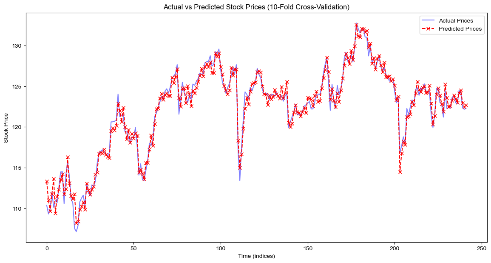
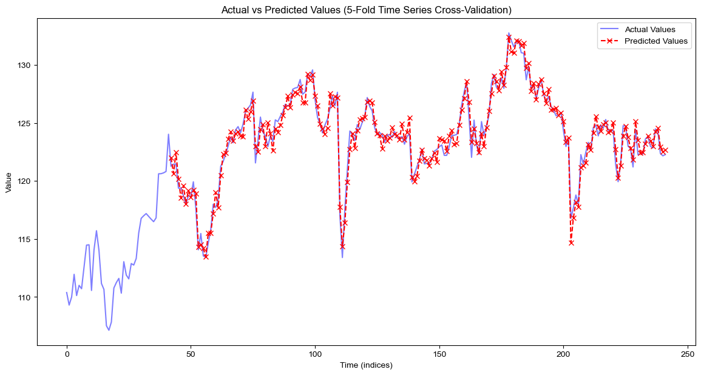
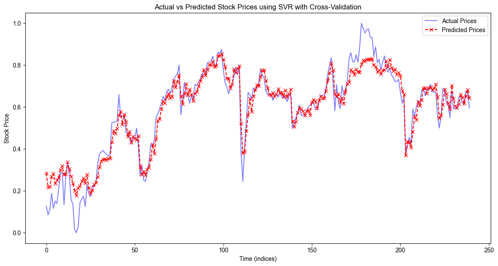
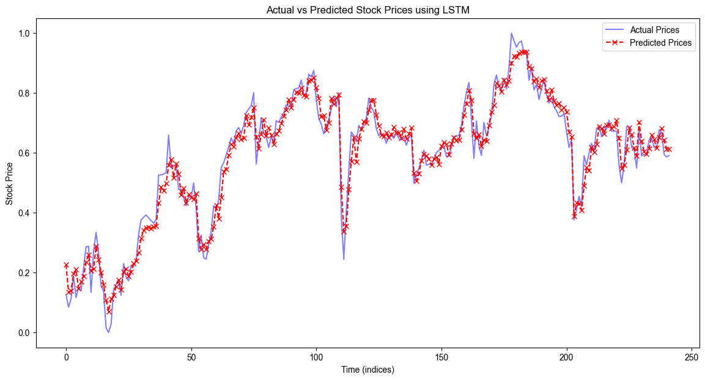
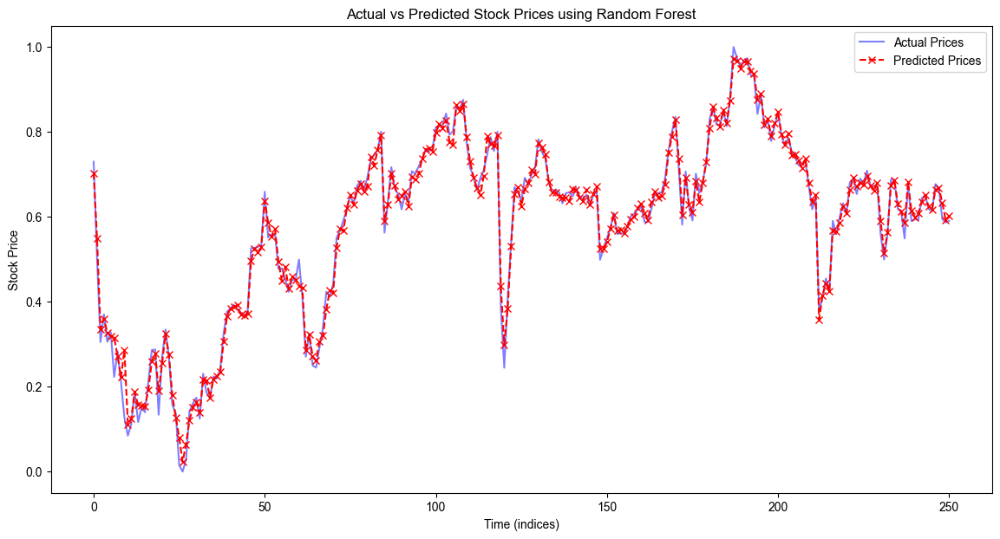

# CS 4641 Final Project

### Introduction and Background

The stock market's fluctuations are influenced by multiple factors including “political events, economic conditions, and investor psychology [6]”. Recent trends show an increased use of machine learning (ML) techniques to improve market forecast accuracy and efficiency. Strader [2] categorizes recent ML research into four main approaches for stock prediction: artificial neural networks, support vector machines, genetic algorithms combined with other techniques, and hybrid of multiple algorithms. These methods aim to enhance the precision of stock market forecasts. We will be using Support Vector Regression, Linear Regression, LSTM, and Random Forest models.

The dataset is New York Stock Exchange data from 2010 to 2016, which includes the daily prices, prices adjusted for stock split, company descriptions, and underlying metrics drawn from the annual SEC 10K filing.

### Problem Definition

1. Problem

    Traditionally, market trends were learned through experience, but now, this is impractical due to the market's size and speed. Basic statistical analysis alone is insufficient for making informed decisions in a fast-trending market.
2. Motivation

    We aim to identify the most accurate market prediction machine learning algorithms that will offer consumers analyses of real-time financial and economic data for making decisions.

### Methods
Data preprocessing was done by calculating rolling averages. For stock prices, rolling averages are typically very well-suited to predicting market trends, both short and long-term [1]. These rolling averages were treated as features in the model. In total, we used 6 different features to predict the stock’s closing price: open price, low, high, volume, and the rolling average price over both 5 and 10 days. If there was an invalid value in any point in a row, that row was removed from the data. Because of the high number of rows and low amount of missing data, we do not expect a point’s removal to have too high of an impact on the overall data.

After calculating rolling averages, all features were normalized so that they could be used more effectively with models like SVR and LSTM. This reduces the impact that features with large numbers have on our models (for example, trade volume). Similarly, the expected outputs were also normalized to get a more accurate picture of our model’s accuracy.

For the more complex models, we chose to add an additional preprocessing method of time-sensitive data augmentation. This technique allows overall trends to be examined as features for ML models by splitting the data into low-frequency and high-frequency patterns. [7] The low-frequency data appears as a more smooth version of the original data, while the high-frequency data is much more noisy and appears almost random.

For our first model, we chose to implement linear regression. This type of model typically performs very well when there is a need to predict trends and movements in data where outcomes are continuous. Linear regression is a relatively simple algorithm as well, which serves as an excellent starting point for the problem that allows us to determine how to proceed with future implementations.

For our second model, we implemented support vector regression, or SVR. SVR is a type of model that is very effective for problems that have a high number of dimensions. It works by finding a line/hyperplane that maximizes the number of points inside a certain area. We included the radial basis function as our kernel for this problem, as it has the ability to train quickly and efficiently on data. 

Our third model was LSTM, or long short-term memory. LSTM is a type of neural network that is capable of “remembering” things, and using this memory to aid its predictions. LSTM's ability to remember patterns for long periods makes it effective for predicting stock prices using historical data. According to Nabipour, deep LSTM with an embedded layer performed better than LSTM with automatic encoding [6].

Finally, we decided to go with a random forest for our last algorithm. Random forest is an ensemble technique that uses a large number of different decision trees trained on random features and data points. It combines weak models into a strong one, capable of managing large, complex data sets. It's useful for analyzing vast stock price data to identify key variables for classification.

Model validation was done by using k-fold validation using 5 and 10 folds as well as time series, and evaluated using performance metrics including Mean Absolute Error (MAE) and Root Mean Squared Error (RMSE) to measure prediction accuracy, R² to gauge the model's explanatory power, and Precision and Recall for classification accuracy. The goal is to minimize MAE and RMSE for close-to-actual predictions, maximize R² for high predictive relevance, and achieve high Precision and Recall for reliable classification. Achieving the goals for these metrics will indicate that the model is capable of making accurate and reliable stock market predictions.

### Results and Discussion

**Linear Regression**

|                         | 5-Fold Linear Regression | 10-Fold Linear Regression |
|:------------------------|:-------------------------|:--------------------------|
| Accuracy                | 95.8897%                 | 95.9468%                  |
| Mean Average Error      | 4.1103%                  | 4.0532%                   |
| Mean Squared Error      | 0.0010130                | 0.0010130                 |
| Root Mean Squared Error | 0.6925                   | 0.03190                   |
| R²                      | 0.9768                   | 0.9767                    | 

As we can see, our current metrics showed very little difference between 5-fold and 10-fold validation. Test accuracy and R^2 were satisfactorily high in both, while RMSE was quite low. The R² value indicates that all of these models are very close to modeling what’s going on in the data, with a very, very strong correlation. Due to the low difference between 5-fold and 10-fold validation, we only used 5-fold validation for the models below.

**SVR**

| Accuracy                | 92.7924%                 |
| Mean Average Error      | 7.2076%                  |
| Mean Squared Error      | 0.003383                |
| Root Mean Squared Error | 0.05817                   |
| R²                      | 0.9231                   |

SVR performed decently, but its overall accuracy after k-fold validation was fairly low. However, removing the first 30 or so elements from y and x result in significantly improved accuracy, as can be seen from the graph. The overall accuracy of 92% is still pretty good, and it has a decent R^2 of .9231. The RMSE and MSE are pretty low, meaning that this model is fairly accurate.
Our SVR model used a radial basis function as its kernel, which performed significantly better than sigmoid, which we also tried to use. 

**LSTM**

| Accuracy                | 94.7572%                 |
| Mean Average Error      | 5.2428%                  |
| Mean Squared Error      | 0.001544                |
| Root Mean Squared Error | 0.03930                   |
| R²                      | 0.9646                   |

LSTM also performed very well, and was our second best performing model after linear regression. This model tended to perform very well except on outlier days, and had a very strong accuracy and R2 (second highest out of all models)

**Random Forest**

| Accuracy                | 94.4394%                 |
| Mean Average Error      | 5.5605%                  |
| Mean Squared Error      | 0.001650                |
| Root Mean Squared Error | 0.04062                   |
| R²                      | 0.9720                   |

Random forest performed surprisingly well. It had the second highest R2 value, indicating that its predictions are very well suited to the data. However, it had the second lowest accuracy out of all the other models. It also took by far the longest to train, which would be a larger concern if we were using more data.

**Overall Discussion and Conclusions**

Overall, linear regression appears to be the model that was best suited to our problem. It was the most accurate by far, with a very high R2 value and a low mean average error. 

An interesting trend to note is that in the beginning of the data for all cases, almost every model was wildly inaccurate. This can most likely be attributed to how at the beginning of the data, there is no rolling average feature (because there’s no data before to compare). Additionally, the data at the beginning also has a much higher variance than some other parts of the data. The one model that does appear to accurately predict the data in the beginning, random forest, was trained on this section. We were unable to complete a full k-fold validation on the data due to time constraints (model training and tuning for one fold takes several minutes).

Future study needs to be done on how better hyperparameter tuning would increase the validity of all our models, as it would likely lead to more accurate models for our data. A system to automatically search and find the better hyperparameters should probably be built. In addition, we need to fully implement k-fold validation for our Random Forest model so that we can more accurately judge the model. Finally, better feature engineering would help us improve accuracy of all our models, such as fully implementing Time Sensitive Data Augmentation. Seeing how various features interact with the models to pick the optimal feature set would help our models become more accurate.

### Reference

[1] Schwab.com, “Understanding simple moving average crossovers,” Schwab Brokerage, https://www.schwab.com/learn/story/understanding-simple-moving-average-crossovers (accessed Apr. 1, 2024).

[2] T. J. Strader et al, "Machine Learning Stock Market Prediction Studies: Review and Research Directions," Journal of International Technology and Information Management, vol. 28, (4), pp. 63-83, 2019. Available: https://www.proquest.com/scholarly-journals/machine-learning-stock-market-prediction-studies/docview/2419750880/se-2.

[3] D. Sheth and M. Shah, “Predicting stock market using machine learning: best and accurate way to know future stock prices,” International Journal of Systems Assurance Engineering and Management, vol. 14, no. 1, pp. 1–18, Jan. 2023, doi: 10.1007/s13198-022-01811-1.

[4] A. Khan et al., “A performance comparison of machine learning models for stock market prediction with novel investment strategy,” PLOS ONE, vol. 18, no. 9, p. e0286362, Sep. 2023, doi: 10.1371/journal.pone.0286362.

[5] K. S. R. Vanukuru, "Stock Market Prediction Using Machine Learning," International Research Journal of Engineering and Technology (IRJET), vol. 05, no. 10, pp. 1032, Nov. 2018, DOI: 10.13140/RG.2.2.12300.77448. 

[6] Nabipour, M.; Nayyeri, P.; Jabani, H.; Mosavi, A.; Salwana, E.; S., S. Deep Learning for Stock Market Prediction. Entropy 2020, 22, 840. https://doi.org/10.3390/e22080840

[7] X. Teng, T. Wang, X. Zhang, L. Lan, and Z. Luo, ‘Enhancing Stock Price Trend Prediction via a Time-Sensitive Data Augmentation Method’, Complexity, vol. 2020, p. 6737951, Feb. 2020.

https://ieeexplore.ieee.org/abstract/document/7783235
https://scholarworks.lib.csusb.edu/jitim/vol28/iss4/3/

## Contribution Table 

| Name          | Contribution                                      |
|---------------|---------------------------------------------------|
| Matthew Rowe  | Model/feature selection, Midterm/Final Report, Final Video, implementation bugfixes and validation         |
| Jared Stanton | Model/feature selection, Midterm Report, Implementing K-fold validation, Final Report, creating Final PPT, Implementation bugfixes for SVR & LSTM.|
| Moungsung Im  | M1 implementation/Coding, M2 implementation/Coding, Midterm Report, M3 implementation, M3 Coding             |
| Seohee Yoon   | M2 Data Cleaning, implementation, Data Visualization, M3 Feature Reduction, visualization     |
| Dongbin Seo   | M1 Data Cleaning, M1 implementation, M1 Data Visualization, implement last 20% prediction, M2 Coding, M2 visualization, M3 Coding     |

## Gantt Chart

https://docs.google.com/spreadsheets/d/1gdDA0MfhDgKv55N_eectzp0srOznWuNAZxiQP6nlWtM/edit?usp=sharing
